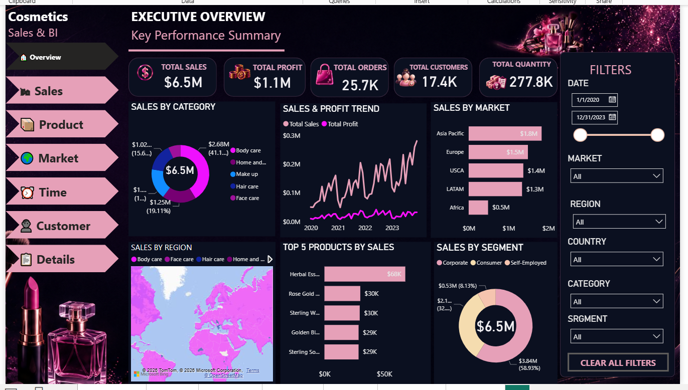
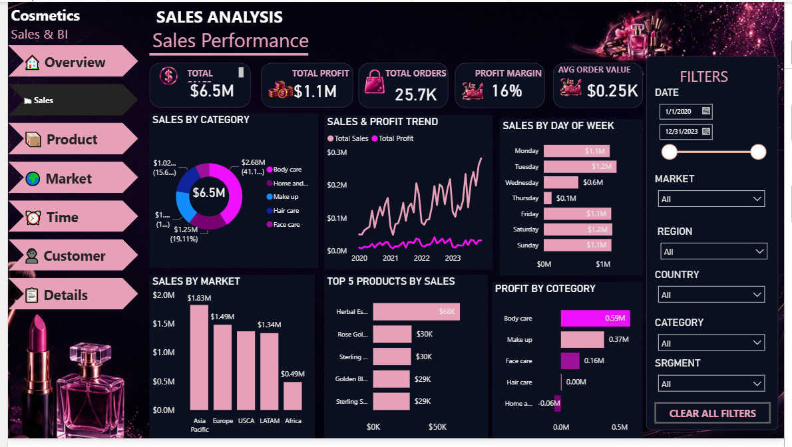
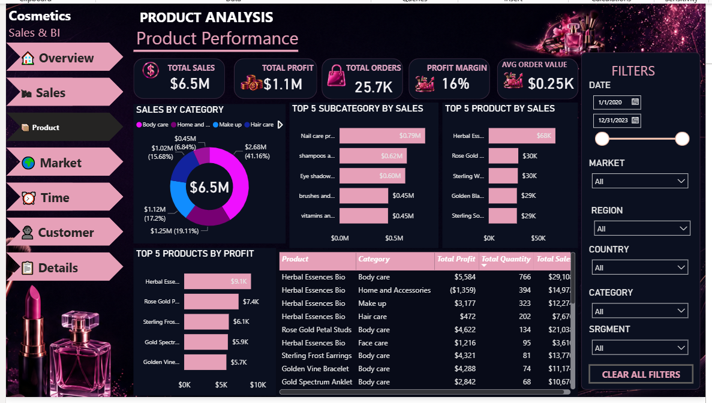
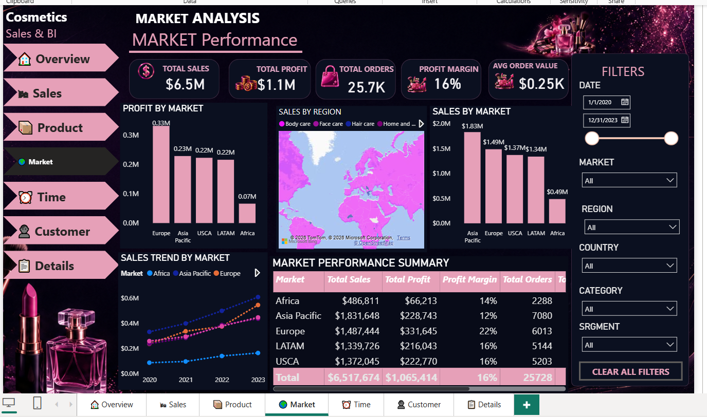
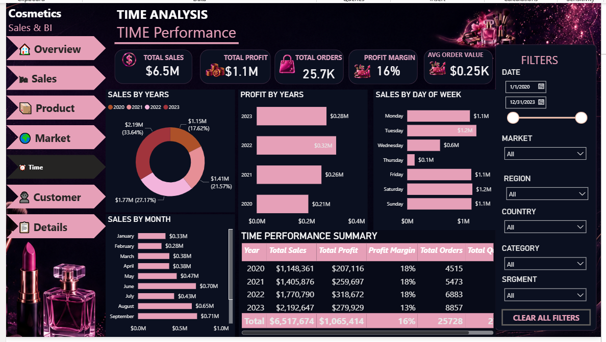
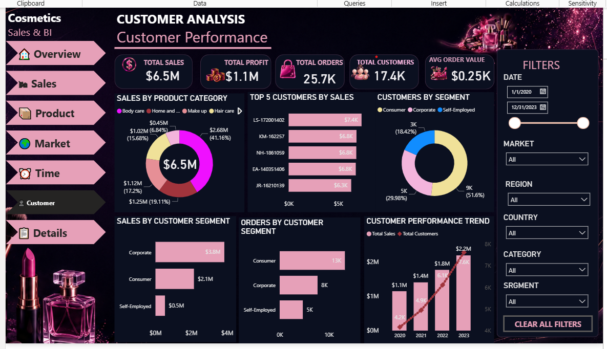
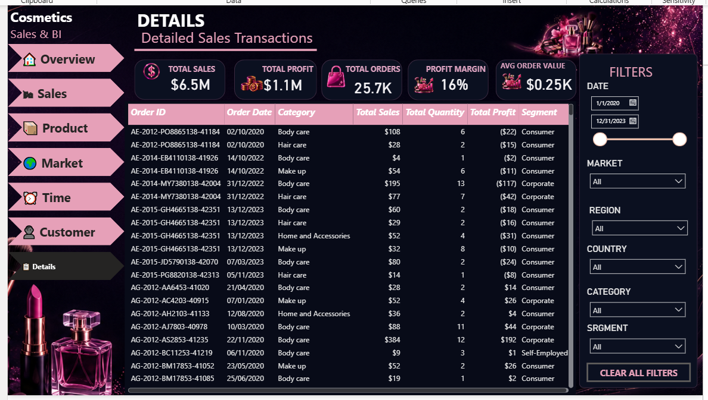

# 💄 Cosmetics Sales & Business Intelligence Dashboard

A professional **Power BI Business Intelligence Dashboard** designed to analyze cosmetics sales performance and transform business data into clear and actionable insights.

The dashboard provides interactive analysis of **sales, profit, orders, customers, products, markets, and time-based performance**.

---

# 📊 Dashboard Preview

## 1. 🏠 Overview

The Overview dashboard provides a high-level summary of the overall business performance using key performance indicators and interactive visualizations.

<p align="center">
  
</p>

---

## 2. 💰 Sales Analysis

The Sales Analysis dashboard provides a detailed view of sales performance, profitability, sales trends, and business performance.

<p align="center">
  
</p>

---

## 3. 📦 Product Analysis

The Product Analysis dashboard focuses on product and category performance and helps identify the best-performing products.

<p align="center">
  
</p>

---

## 4. 🌍 Market Analysis

The Market Analysis dashboard compares sales and profitability across different markets and geographical areas.

<p align="center">
  
</p>

---

## 5. ⏰ Time Analysis

The Time Analysis dashboard analyzes sales and profit performance across different time periods.

<p align="center">
  
</p>

---

## 6. 👥 Customer Analysis

The Customer Analysis dashboard provides insights into customer performance, customer segments, and purchasing behavior.

<p align="center">
  
</p>

---

## 7. 📋 Details

The Details dashboard provides a detailed view of the available business and transactional data.

<p align="center">
  
</p>

---

# 🎯 Key Performance Indicators

The dashboard focuses on important business KPIs including:

* 💰 **Total Sales**
* 📈 **Total Profit**
* 🛒 **Total Orders**
* 📦 **Total Quantity**
* 👥 **Total Customers**
* 📊 **Profit Margin**
* 💵 **Average Order Value**

---

# 🔍 Business Analysis

### 💰 Sales Analysis

Analyze sales performance by:

* Products
* Categories
* Markets
* Customers
* Regions
* Time periods

### 📦 Product Analysis

Analyze:

* Top-performing products
* Best-selling categories
* Product profitability
* Product contribution to total sales

### 🌍 Market Analysis

Compare:

* Markets
* Regions
* Sales performance
* Profitability

### ⏰ Time Analysis

Analyze business trends by:

* Year
* Month
* Day
* Sales
* Profit

### 👥 Customer Analysis

Analyze:

* Customer performance
* Customer segments
* Purchasing behavior
* Customer contribution to sales

---

# ⚙️ Interactive Features

The dashboard includes:

* 🔎 Interactive filters
* 📅 Date filtering
* 🌍 Market filtering
* 📦 Product filtering
* 👥 Customer filtering
* 📊 Interactive charts
* 🖱️ Cross-filtering
* 🧭 Page navigation
* 📌 KPI cards

---

# 🛠️ Tools & Technologies

### Microsoft Power BI

Used for:

* Data visualization
* Dashboard development
* Data modeling
* Interactive reporting
* Business intelligence

### DAX

Used for:

* Measures
* KPIs
* Calculated metrics
* Sales calculations
* Profit calculations

### Power Query

Used for:

* Data cleaning
* Data transformation
* Data preparation

---

# 📁 Repository Structure

```text
COSMETICS/
│
├── COSMETICS.pbix
├── COSMETICS.rar
├── Overview.png
├── Sales.png
├── Product.png
├── Market.png
├── Time.png
├── Customer.png
├── Details.png
└── README.md
```

---

# 🚀 How to Use

1. Clone or download the repository.
2. Open `COSMETICS.pbix` using **Microsoft Power BI Desktop**.
3. Navigate through the dashboard pages.
4. Use the available filters and slicers.
5. Interact with the charts and KPI cards.
6. Explore the different business insights.

---

# 💡 Business Value

This dashboard helps businesses:

* Monitor overall sales performance.
* Track profitability.
* Identify high-performing products.
* Understand customer behavior.
* Compare market performance.
* Discover sales trends.
* Support data-driven decision making.

---

# ⭐ Project Highlights

* ✅ Professional Power BI Dashboard
* ✅ Interactive multi-page reporting
* ✅ Sales & Profit Analysis
* ✅ Product Analysis
* ✅ Market Analysis
* ✅ Time Analysis
* ✅ Customer Analysis
* ✅ Detailed Business Analysis
* ✅ KPI-driven reporting
* ✅ Interactive filtering and navigation
* ✅ Business-focused data visualization

---

# 👨‍💻 Author

**Abdel-Alim Wagih Fathy**

**Data Analyst | Power BI | Business Intelligence | Data Visualization**

---

# ⭐ Support

If you find this project useful, consider giving the repository a ⭐ and sharing your feedback.

---

<p align="center">
  <strong>💄 Cosmetics Sales Dashboard</strong>
  <br>
  Turning sales data into actionable business insights with Power BI.
</p>
